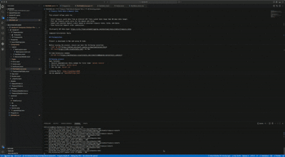

# Treasury Yield Data & Deposit Term

This project allows users to:

- Fetch treasury yield data from an external API from a given date range (max 90 days date range).
- Plot the treasury yield curve for the amount and terms.
- Submit and simulate deposit orders based on selected treasury rates, terms, and dates.
- View historical deposit order submissions.

Third-party API Data Used: https://site.financialmodelingprep.com/developer/docs/stable/treasury-rates

Compound Calculation: Daily

## Prerequisites

Project is developed in Mac and using VS Code.

Stack:
- Web Framework: Blazor
- C# .NET Core

Before running the project, ensure you have the following installed:
- [.NET 10 SDK](https://dotnet.microsoft.com/en-us/download/dotnet/10.0)
- [VS Code](https://code.visualstudio.com/) for Mac

VS Code Extensions needed:
- [C# DEV Kit](https://marketplace.visualstudio.com/items?itemName=ms-dotnettools.csdevkit)

## Running project:
Open Terminal:
1. Restore Dependencies (Only needed for first time) `dotnet restore`
2. Build the project `dotnet build`
3. Run the app `dotnet run`

Listening Port: `http://localhost:5028`
Can be updated in `launchSettings.json`

## Demo
